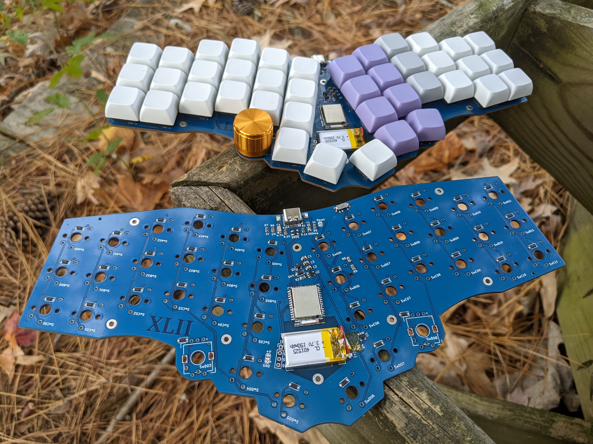
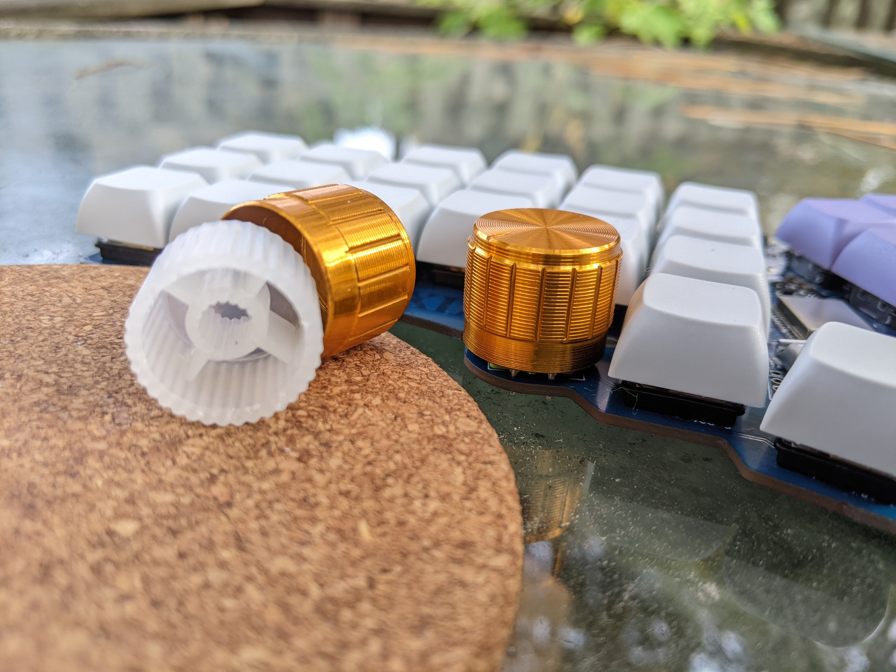

# One42 | 42-key 30deg. angled-unsplit

- v2 (& v1) choc switches (soldered)
- Integrated/onboard wireless controller (holyiot 18010; hello ZMK!)
- 18.8mm sq.spacing (most keycap dimensions are actually 18.0-18.3mm)
- 30 degree angled halves
- Rotary encoders (2x optional) at outer-thumb positions **
- No lighting. I value compact-wireless more than rgb’s and bigger batteries.
- Hand-solderable

## Firmware
[zmk-config](https://github.com/cyril279/zmk-config-one42) << fork, adjust the keymap, and let github build your firmware.  
There are links to the bootloader (if needed), as well as flashing instructions at the link-above.  
For more info on ZMK itself, [* start here *](https://zmk.dev/docs)  

## Encoder fitment
The placement of these encoders allows the use of 21mm diameter knobs.  
  At this diameter, some of the knobs are able to fit down over the body of the encoder for a lower-profiled encoder.  
  Shown below is a 12mm tall encoder adorned with a 21mm diameter knob.  

## What about a case?
good question. maybe probably.  
I am thinking about two approaches:  
1) An additional 1/16”thk material (pcb?) to attach to the bottom of the main-pcb so that the pokey-bits of the switches will be flush with the bottom of the unit.  
    This facilitates the application of an adhesive foam bottom layer.  This is the most affordable approach to something that is both protective and more back-pack friendly.  
2) A minimal case to be 3d-printed.

## Lessons-learned v0.1
1) The pg-1353 switches do not self-align well without a switch-plate.  
  I had hoped (assumed) that the third-leg of the 1353's would do a sufficient job of positioning the switches.  
  My previous designs all involved switch-plates (for aesthetic reasons) so I was unaware that this would be an issue.    
  I will likely offer this board with an integrated switch-plate.  
2) The oval holes for the encoder remove the alignment features for the pg-1350 (choc-v1) switches.  
  I am hoping that the integrated switch-plate can also cover this issue.  

## Thank You.
- [gtips reviung41](https://github.com/gtips/reviung) was the initial inspiration  
- [dezli’s ahokore](https://github.com/dezlidezlidezli/ahokore) was the schematic-template  
- The [low-profile keyboard discord](https://discord.gg/eEK5yUh) is wonderfully encouraging and supportive  
- All things open-source!  
